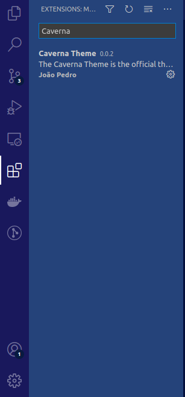

# [Caverna VsCode Theme](https://marketplace.visualstudio.com/items?itemName=jpbrab0.caverna-theme)

    

---

## Theme for A Caverna do patocórnio discord community.

    

    

---

## Install the theme

**Installing from VsCode Extentions**:

Search ``Caverna`` in Vscode Extentions and click in ``Install``

**Installing from Command Line**:

Press <kbd>Ctrl</kbd> + <kbd>P</kbd>, type ``ext install jpbrab0.caverna-theme`` and press <kbd>ENTER</kbd>

---

**Theme made by [A Caverna Do Patocórnio](https://github.com/acaverna)**